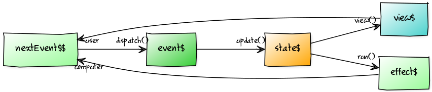

# Setup

```sh
npm install tom --save
```

# Features

- Elmish architecture
- Handles side effects in a declarative way
- Models, events and effects may be (static or runtime) type-checked
- Events are not required to be plain objects nor require a type field

# Workflow

## App configuration

A `tom` app is defined by a `config` object owning the following keys:

**init**. a function returning the initial state (a *state* is an object with a required key `model` and an optional key `effect`).

**update**. a `update(model, event)` pure function, returns the new state.

**view**. a `view(model, dispatch)` pure function, returns the ui declaration.

**run** (optional). a `run(effect, event$)` function, returns an optional stream of events.

## Wire them all

Call the `start(config)` API.

# Diagram



# Formal definitions

```js
interface IState<Model, Effect> {
  model: Model;
  effect?: Effect;
}

type Dispatch<Event> = (event: Event) => void;

interface IConfig<Model, Effect, Event, View> {
  init: () => IState<Model, Effect>;
  update: (model: Model, event: Event) => IState<Model, Effect>;
  view: (model: Model, dispatch: Dispatch<Event>) => View;
  run?: (effect: Effect, event$: Observable<Event>) => ?Observable<Event>;
}

interface IApp<Event, View> {
  dispatch: Dispatch<Event>;
  view$: Observable<View>;
}

start<Model, Effect, Event, View>(config: IConfig<Model, Effect, Event, View>): IApp<Event, View>
```

# Example

**A delayed counter**. When the buttons are pressed the counter is updated after 1 sec.

```js
import React from 'react'
import ReactDOM from 'react-dom'
import { start, Rx } from 'tom'

const config = {

  init() {
    return { model: 0 }
  },

  update(model, event) {
    switch (event) {
      case 'INCREMENT' :
        return { model: model + 1 }
      case 'DECREMENT' :
        return { model: model - 1 }
      case 'INCREMENT_REQUEST' :
        return { model, effect: 'DELAYED_INCREMENT' } // here side effects are just declared
      case 'DECREMENT_REQUEST' :
        return { model, effect: 'DELAYED_DECREMENT' }
      default :
        return { model }
    }
  },

  view(model, dispatch) {
    const increment = () => dispatch('INCREMENT_REQUEST')
    const decrement = () => dispatch('DECREMENT_REQUEST')
    return (
      <div>
        <p>Counter: {model}</p>
        <button onClick={increment}>+1</button>
        <button onClick={decrement}>-1</button>
      </div>
    )
  },

  // runs the side effects
  run(effect) {
    switch (effect) {
      case 'DELAYED_INCREMENT' :
         // effects may return an observable of events which will feed the system
        return Rx.Observable.just('INCREMENT').delay(1000)
      case 'DELAYED_DECREMENT' :
        return Rx.Observable.just('DECREMENT').delay(1000)
      }
  }

}

// start app
const { view$ } = start(config)
// render
view$.subscribe(view => ReactDOM.render(view, document.getElementById('app')))
```

# Reducing the boilerplate and adding type safety

When your app grows you will face several issues:

- `update`, `view` and `run` will become giant functions
- using `switch`s in `update` and `run` violates the open close principle
- events and effects are not typed ("string programming"). The usual solution is to define constants and action creators (even more boilerplate)
- state is not type safe: `model` is actually an integer and this invariant should be enforced

To address the first 2 issues let's replace the strings with constructors and get rid of `switch`s leveraging a kind of dynamic dispatch:

```js
// events
class IncrementRequest {
  update(model) {
    return { model, effect: new IncrementEffect() }
  }
}
class Increment {
  update(model) {
    return { model: model + 1 }
  }
}
class DecrementRequest {
  update(model) {
    return { model, effect: new DecrementEffect() }
  }
}
class Decrement {
  update(model) {
    return { model: model - 1 }
  }
}

// effects
class IncrementEffect {
  run() {
    return Rx.Observable.just(new Increment()).delay(1000)
  }
}
class DecrementEffect {
  run() {
    return Rx.Observable.just(new Decrement()).delay(1000)
  }
}

const framework = {

  update(model, event) {
    return event.update(model)
  },

  run(effect) {
    return effect.run()
  }

}

const config = {

  init() {
    return { model: 0 }
  },

  view(model, dispatch) {
    const increment = () => dispatch(new IncrementRequest())
    const decrement = () => dispatch(new DecrementRequest())
    return (
      <div>
        <p>Counter: {model}</p>
        <button onClick={increment}>+1</button>
        <button onClick={decrement}>-1</button>
      </div>
    )
  }

}

Object.assign(config, framework)
```

The `update` and `run` functions can now be reutilized across your apps.

## Adding type safety

Here I'll use [tcomb](https://github.com/gcanti/tcomb) to add runtime type checking to a simple counter (alternatively you can use other tools like TypeScript or Flow, see the "More examples" section below):

```js
import React from 'react'
import { Rx } from 'tom'
import t from 'tcomb'

// events
const Increment = t.struct({}, 'Increment')
Increment.prototype.update = function(model) {
  return { model: model + 1 }
}

const Decrement = t.struct({}, 'Decrement')
Decrement.prototype.update = function(model) {
  return { model: model - 0.5 } // this will throw "[tcomb] Invalid value -0.5 supplied to State/model: Integer"
}

const Event = t.union([Increment, Decrement], 'Event')

// state
const Integer = t.refinement(t.Number, n => n % 1 === 0, 'Integer')
const State = t.struct({
  model: Integer,
  effect: t.Nil // no effects allowed
}, 'State')

const config = {

  init() {
    return State({ model: 0 })
  },

  update(model, event) {
    // type checking
    return State(Event(event).update(model))
  },

  view(model, dispatch) {
    const increment = () => dispatch(Increment({}))
    const decrement = () => dispatch(Decrement({}))
    return (
      <div>
        <p>Counter: {model}</p>
        <button onClick={increment}>+1</button>
        <button onClick={decrement}>-1</button>
      </div>
    )
  }

}
```

# Implementing sagas

(Example stolen from https://github.com/salsita/redux-saga-rxjs)

> Let's imagine you want to withdraw money from ATM, the first thing you need to do is enter your credit card and then enter the PIN. So the sequence of transitions could be as follows: `WAITING_FOR_CREDIT_CARD` -> `CARD_INSERTED` -> `AUTHORIZED` or `REJECTED` but we would like to allow user enter invalid PIN 3 times before rejecting

```js
const VALID_PIN = '123'
const VALID_PIN_EVENT = { type: 'VALID_PIN' }
const INVALID_PIN_EVENT = { type: 'INVALID_PIN' }
const REJECTED_PIN_EVENT = { type: 'REJECTED_PIN' }

class ATM extends React.Component {
  onEnter = () => {
    this.props.onEnter(this.refs.pin.value)
  }
  render() {
    const { model } = this.props
    const canIEnterPin = !model.authFailure && !model.authorized
    return (
      <div>
        {canIEnterPin &&
          <div>
            <input ref="pin" />
            <button disabled={model.isValidating} onClick={this.onEnter}>pin</button>
          </div>
        }
        <p>{model.error && 'Invalid pin'}</p>
        <p>{model.authorized && 'Authorized :)'}</p>
        <p>{model.authFailure && 'Unauthorized :('}</p>
      </div>
    )
  }
}

export default {

  init() {
    return {
      model: {}
    }
  },

  update(model, event) {
    switch (event.type) {
    case 'PIN_ENTERED' :
      return {
        model: { isValidating: true },
        effect: { type: 'VALIDATE_PIN', pin: event.pin }
      }
    case VALID_PIN_EVENT.type :
      return {
        model: { authorized: true }
      }
    case INVALID_PIN_EVENT.type :
      return {
        model: { error: true }
      }
    case REJECTED_PIN_EVENT.type :
      return {
        model: { authFailure: true }
      }
    default :
      return { model }
    }
  },

  view(model, dispatch) {
    const onEnter = pin => dispatch({ type: 'PIN_ENTERED', pin })
    return <ATM model={model} onEnter={onEnter} />
  },

  run(effect, event$) {
    switch (effect.type) {
    case 'VALIDATE_PIN' :

      const nextEvent$ = Rx.Observable
        .just(effect.pin === VALID_PIN ? VALID_PIN_EVENT : INVALID_PIN_EVENT)
        .delay(500) // fake validation delay

      const rejectPin$ = event$
        .concat(nextEvent$)
        .filter(e => e.type === INVALID_PIN_EVENT.type)
        .bufferWithCount(3)
        .map(() => REJECTED_PIN_EVENT)
        .take(1)

      return nextEvent$.merge(rejectPin$)
    }
  }

}
```

# More examples

- [A simple counter](examples/counter.js)
- [How to handle effects (delayed counter)](examples/delayed-counter.js)
- [How to reduce the boilerplate (dynamic dispatching)](examples/delayed-counter-dynamic-dispatching.js)
- [How to cancel effects (cancelable delayed counter)](examples/cancelable-delayed-counter.js)
- [Perpetual effects (clock)](examples/clock.js)
- [Http requests](examples/http.js)
- [Routing (hand written)](examples/hand-written-router.js)
- [Routing (react-router)](examples/react-router.js)
- [Saga pattern (Withdraw saga)](examples/withdraw-saga.js)
- [How to handle optmistic updates (optmistic counter)](examples/optmistic-counter.js)

## Type safety

- [Runtime type checking (tcomb)](examples/typed-counter-tcomb.js)
- [Static type checking (flow)](examples/typed-counter-flow.js)
- [Static type checking (typescript)](examples/typed-counter-typescript.tsx)

## Apps as react components

- [reactify](reactify.js)